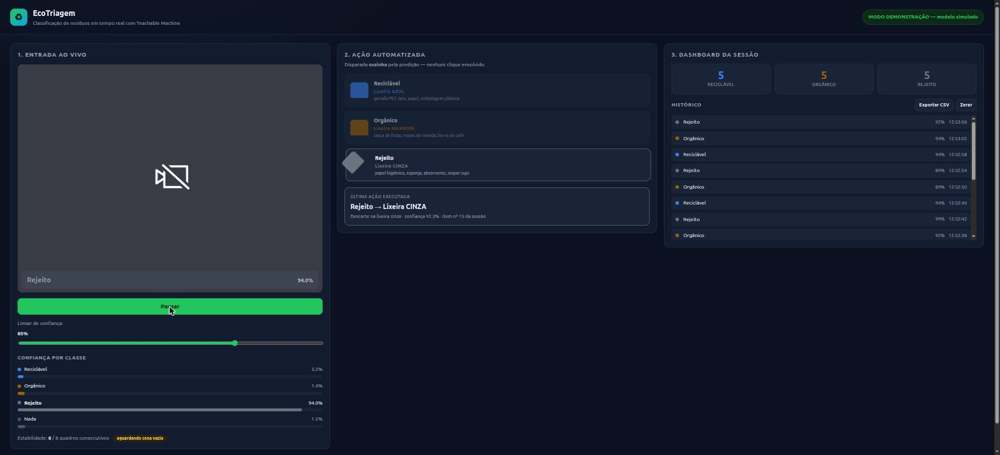

# ♻️ EcoTriagem — classificador de resíduos com ação automatizada

Aplicação web que usa um modelo de **classificação de imagem treinado no
Teachable Machine** para identificar, pela webcam, o tipo de resíduo que a
pessoa está segurando e **acionar automaticamente a lixeira correta** — sem
nenhum clique.

**Dupla:** `NOME 1 (RA ...)` · `NOME 2 (RA ...)` <!-- TODO: preencher -->



<!-- TODO: substituir/complementar pelo GIF gravado com o modelo real -->
<!--  -->

---

## O problema

A maior parte do lixo reciclável no Brasil vai para o aterro por **erro de
separação na origem**: quem descarta não sabe em qual lixeira o item vai. O
EcoTriagem funciona como um totem de apoio ao descarte: a pessoa mostra o
resíduo, o sistema reconhece a categoria e **abre a lixeira certa**, fala a
instrução em voz alta e registra o item no dashboard de triagem do local.

## Classes treinadas

| Classe | Lixeira (CONAMA 275/2001) | Exemplos usados no treino |
| --- | --- | --- |
| **Reciclável** | 🔵 Azul | garrafa PET, lata de alumínio, papel, embalagem plástica |
| **Orgânico** | 🟤 Marrom | casca de fruta, restos de comida, borra de café |
| **Rejeito** | ⚪ Cinza | papel higiênico, esponja, absorvente, isopor sujo |
| **Nada** | — | cena vazia, fundo, mão sem objeto |

> A classe **Nada** é obrigatória por um motivo prático: sem uma classe de
> fundo, o modelo é forçado a escolher sempre uma das três categorias úteis e
> passa a disparar ações à toa. Aqui ela também serve para **rearmar** o
> gatilho entre um item e o próximo.

## A ação automatizada

A predição do modelo é a **única** coisa capaz de disparar a ação — nenhum
botão da interface a executa. Quando uma classe é confirmada
(`src/core/actions.ts`), quatro coisas acontecem de uma vez:

1. **Atuador** — a lixeira correspondente ganha destaque e a tampa abre
   (animação que representa o acionamento do dispositivo físico).
2. **Áudio** — um bipe com timbre próprio de cada categoria (880 Hz / 587 Hz /
   392 Hz) + a instrução falada em pt-BR via `SpeechSynthesis`.
3. **Visual** — flash na cor da lixeira sobre a imagem da câmera.
4. **Registro** — o contador daquela categoria é incrementado e o item entra no
   histórico da sessão (persistido em `localStorage`, exportável em CSV).

### Como o falso positivo é evitado

Vídeo ao vivo produz predições instáveis. O gatilho
(`src/core/stabilizer.ts`) tem três travas:

| Trava | Valor padrão | Por quê |
| --- | --- | --- |
| **Limiar de confiança** | 85 % (ajustável na tela) | predição abaixo disso oscila entre classes e faz a interface piscar |
| **Estabilidade** | 8 quadros consecutivos da mesma classe | um quadro borrado no meio do movimento não conta como detecção |
| **Rearme** | precisa passar por “cena vazia” | sem isso, um objeto parado na frente da câmera seria contado dezenas de vezes |

## Stack

- **TypeScript** + **Vite** (aplicação web, sem back-end)
- **@teachablemachine/image** + **@tensorflow/tfjs** — o modelo roda **100 % no
  navegador**, então a inferência é local e o deploy é um site estático
- **Web Audio API** e **Web Speech API** para o feedback sonoro

Formato de exportação escolhido: **TensorFlow.js** — é o único que roda direto
no cliente, sem servidor de inferência.

---

## Como rodar localmente

### Pré-requisitos

- **Node.js 18 ou superior** (`node -v` para conferir) e npm
- Um navegador com suporte a webcam: **Chrome, Edge ou Firefox**
- Uma **webcam** funcionando

### 1. Clonar e instalar

```bash
git clone https://github.com/Arthorioscal/triagem-residuos.git
cd triagem-residuos
npm install
```

### 2. Conferir se o modelo está no lugar

A pasta `public/model/` precisa conter os três arquivos exportados do
Teachable Machine:

```
public/model/
├── model.json
├── metadata.json
└── weights.bin
```

Eles já vêm versionados neste repositório. Se quiserem treinar um modelo
próprio, o passo a passo está em [`public/model/README.md`](public/model/README.md).

### 3. Executar

```bash
npm run dev
```

O Vite abre `http://localhost:5173` automaticamente. **Autorize o acesso à
câmera** quando o navegador pedir — é obrigatório, é dela que vem a entrada ao
vivo.

> ⚠️ Abra sempre por `http://localhost`. Navegadores só liberam a webcam em
> `localhost` ou em HTTPS; abrir o `index.html` como arquivo (`file://`) não
> funciona.

### Usando

1. Aponte um resíduo para a câmera.
2. Acompanhe a **confiança de cada classe** na coluna 1 e o contador de
   estabilidade (`n/8 quadros`).
3. Ao atingir 8 quadros acima do limiar, a **lixeira correta abre sozinha**, o
   sistema fala a instrução e o item entra no dashboard.
4. Afaste o objeto (classe *Nada*) para rearmar e triar o próximo item.

### Outros comandos

```bash
npm run typecheck   # checagem de tipos do TypeScript
npm run build       # gera o site estático em dist/
npm run preview     # serve o dist/ para conferir o build
```

### Modo demonstração (sem modelo / sem webcam)

Para conferir a interface e a ação antes de o modelo estar treinado:

```
http://localhost:5173/?demo=1
```

Um classificador simulado (`src/model/mockClassifier.ts`) alterna entre as
classes com o mesmo formato de saída do Teachable Machine. **Não vale como
entrega** — serve só para desenvolver a interface.

---

## Estrutura do projeto

```
.
├── index.html                  # estrutura da página
├── public/model/               # modelo exportado do Teachable Machine (TF.js)
├── docs/                       # print e GIF da demonstração
└── src/
    ├── main.ts                 # laço de inferência: captura → predição → gatilho → ação
    ├── config.ts               # limiar, nº de quadros, cooldown e mapa classe → lixeira
    ├── types.ts                # contratos compartilhados
    ├── model/
    │   ├── classifier.ts       # carrega e consulta o modelo do Teachable Machine
    │   ├── mockClassifier.ts   # modelo simulado do ?demo=1
    │   └── webcam.ts           # acesso à câmera
    ├── core/
    │   ├── stabilizer.ts       # decide QUANDO a predição vira ação
    │   ├── actions.ts          # A AÇÃO AUTOMATIZADA
    │   └── store.ts            # contadores, histórico, persistência e CSV
    └── ui/
        ├── dashboard.ts        # todo o desenho da interface
        └── feedback.ts         # bipe (Web Audio) e voz (Web Speech)
```

A lógica não conhece o DOM e a interface não conhece o modelo — dá para trocar
o classificador (foi o que o `?demo=1` faz) sem tocar em nada mais.

## Ajustes possíveis

Tudo em [`src/config.ts`](src/config.ts):

| Constante | Padrão | Efeito |
| --- | --- | --- |
| `confidenceThreshold` | `0.85` | limiar inicial do slider |
| `stableFrames` | `8` | quadros consecutivos exigidos |
| `cooldownMs` | `2000` | intervalo mínimo entre duas ações |
| `inferenceFps` | `10` | quadros classificados por segundo |
| `mirror` | `true` | espelhar a imagem da webcam |

Para usar **outros nomes de classe** no Teachable Machine, acrescente o apelido
no mapa `ALIASES` do mesmo arquivo. Rótulo não reconhecido é tratado como
neutro e nunca dispara ação.

## Solução de problemas

| Sintoma | Causa provável |
| --- | --- |
| “Não foi possível carregar o modelo…” | os três arquivos não estão em `public/model/` |
| “Este navegador não expõe a webcam” | página aberta via `file://` em vez de `http://localhost` |
| Imagem preta | outro programa está usando a câmera, ou a permissão foi negada — reveja em 🔒 na barra de endereço |
| Nenhuma ação dispara | confiança nunca passa do limiar: baixe o slider ou colete mais amostras de treino |
| Ação dispara sozinha com a cena vazia | faltam amostras na classe **Nada** |
| Sem som | o navegador libera áudio só depois de um clique — clique em **Pausar/Retomar** uma vez |
